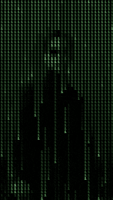

## Hi there I'm Muhamed 👋

    Im an aspiring developer interested in automation and testing. I started my journey with building PCs, fixing hardware and now I want to contribute to digital world.
  All my projects were built through my learning process with purpose to be useful in real life.
    

 
    
- 👨‍💻 I’m currently working on expenses tracker program (See DEMO:

  https://www.youtube.com/watch?v=G-71lMS3w58)  and bot/test DEMO:
  
  https://www.youtube.com/watch?v=Q6dtIxf8pk4
- 🔄 I’m currently learning automation and testing
- 🎓 Attending Harvard's CS50x

### TOOLS AND LANGUAGES:

 
 
 
 
  
 
 

 
